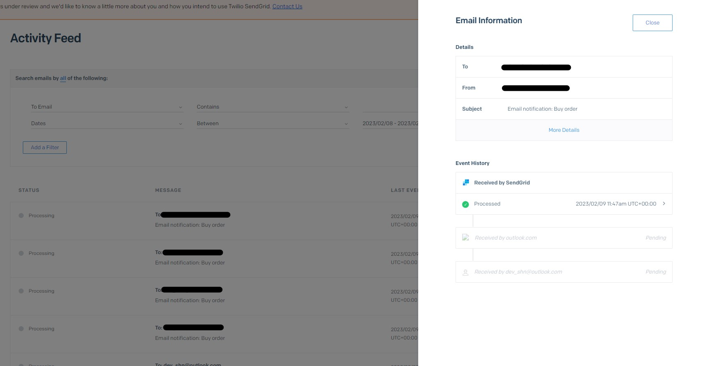

# Facebook Messenger Chatbot

This app was forked from Facebook's sample base app and modified to fit personal requirements. \
\
The Facebook page that I have used in this app is a test page that I have created just for development and testing purposes which can be found here [My Facebook Dev Page](https://www.facebook.com/profile.php?id=100089784654640). Do contact me if you need me to deploy my app so that the chatbot responds, this is to prevent anyone that has access to my facebook page from spamming my chat bot.

# Setting up your Messenger App

## Requirements

- **Facebook Page:** Will be used as the identity of your messaging experience. When people chat with your page. To create a new Page, visit https://www.facebook.com/pages/create.
- **Facebook Developer Account:** Required to create new apps, which are the core of any Facebook integration. You can create a new developer account by going to the [Facebook Developers website](https://developers.facebook.com/) and clicking the "Get Started" button.
- **Facebook App:** Contains the settings for your Messenger automation, including access tokens. To create a new app, visit your [app dashboard](https://developers.facebook.com/apps).

## Setup Steps

Before you begin, make sure you have completed all of the requirements listed above. At this point you should have a Page and a registered Facebook App.

#### Get the App id and App Secret

1. Go to your app Basic Settings, [Find your app here](https://developers.facebook.com/apps)
2. Save the **App ID** number and the **App Secret**

#### Grant  Messenger access to your Facebook App

1. Go to your app Dashboard
2. Under _Add Product_ find _Messenger_ and click _Set Up_
3. Now you should be in the App Messenger Settings
4. Under Access Tokens, click on _Add or Remove Pages_
5. Select the desired page and allow "Manage and access Page conversations" in Messenger
6. Select the desired page and an access token should appear
7. Get the Page ID from the page access token by using the [Access Token Debugger](https://developers.facebook.com/tools/debug/accesstoken/)
8. Subscribe your webhook by adding your callback url (your ngrok external url suffixed with the "/webhook" path. e.g. https://1c3b838deacb.ngrok.io/webhook), and adding the same verify token that you will be setting in your .env file.
9. In the section Built-In NLP, select your page and enable the toggle

# Installation

Clone this repository on your local machine:

```bash
$ git clone https://github.com/hnsia/FbMessengerWebhook.git
$ cd FbMessengerWebhook
```

You will need:

- [Node](https://nodejs.org/en/) 10.x or higher
- A local tunneling service such as [ngrok](https://ngrok.com/), or your own webserver.

## 1. Installing ngrok (tunneling service)
 

If not already installed, install ngrok via [download](https://ngrok.com/download) or via command line:

```bash
npm install -g ngrok
```

In the directory of this repo, request a tunnel to your local server with your preferred port
```bash
ngrok http 3000
```

The screen should show the ngrok status:

```
Session Status                online
Account                       Redacted (Plan: Free)
Version                       2.3.35
Region                        United States (us)
Web Interface                 http://127.0.0.1:4040
Forwarding                    http://1c3b838deacb.ngrok.io -> http://localhost:3000
Forwarding                    https://1c3b838deacb.ngrok.io -> http://localhost:3000

Connections                   ttl     opn     rt1     rt5     p50     p90
                              0       0       0.00    0.00    0.00    0.00
```
Note the https URL of the external server that is fowarded to your local machine. In the above example, it is `https://1c3b838deacb.ngrok.io`.

## 2. Install the dependencies

Open a new terminal tab, also in the repo directiory.

```bash
$ npm install
```

Alternatively, you can use [Yarn](https://yarnpkg.com/en/):

```bash
$ yarn install
```

## 3. Install MongoDB

- Setup MongoDB by following the instructions on https://www.mongodb.com/
- You may also use MongoDB compass which is the UI tool.
- You may choose to either setup a cloud database or just setup a localhost database, either is fine, I used a localhost database.
- Import the dataset from products.json into the database.

## 4. Register a SendGrid account to get the API key

- Register an account here https://sendgrid.com/
- Create an API key in `Setings > API keys > Create API Key` and note it down.
- Authenticate the email address that you will be using to get the notification alert in `Settings > Sender Authentication > Single Sender Verification`
- Do note that your SendGrid account will be under review and would not be able to sent out the emails that it has received until the review is completed. You can still verify that SendGrid has received your emails by checking the actifity feed.

## 5. Set up .env file

Copy the file `.sample.env` to `.env`

```bash
cp .sample.env .env
```

Edit the `.env` file to add all the values for your app and page. Note that `APP_URL` will be the external URL from step 1. `ATLAS_URI` will be your MongoDB connection string. `SENDGRID_EMAIL` will be the email that you have authenticated in step 4. `VERIFY_TOKEN` is any random string that you would like to use as a private key to authenticate with facebook's webhooks, you would need to add the same string on the `VERIFY_TOKEN` your app on your Meta developer platform.

## 4. Run your app locally

```bash
node app.js
or
npm start
```

You should now be able to access the application in your browser at [http://localhost:3000](http://localhost:3000)

Confirm that you canalso access it at the external URL from step 1.

## 5. Configure your webhook subcription and set the Messenger profile

Use the `VERIFY_TOKEN` that you created in `.env` file and call the **/profile** endpoint in your browser or via cURL:
```
http://localhost:3000/profile?mode=all&verify_token=verify-tokenl
```

This will configure your webhook.

## 6. Test that your app setup is successful

Send a message to your Page from Facebook or in Messenger.

You should see the webhook called in the ngrok terminal tab, and in your application terminal tab.

If you see a response to your message in messenger, you have fully set up your app! Voilà!

# Available features
## 1. Random greeting message
When you message the bot with a greeting, the bot will respond with a random greeting. When NLP is turned on, it will detect the sentiment of your message with Wit.ai to determine whether your message is indeed a greeting.


## 2. Commands
The bot accepts the following commands:
1. `/desc <productID>` - returns the description of the selected product with the selected product ID (sku field in the json file).
2. `/price <productID>` - returns the price of the selected product with the selected product ID (sku field in the json file).
3. `/shipping <productID>` - returns the shipping fee of the selected product with the selected product ID (sku field in the json file).
4. `/buy <productID>` - returns an order submitted message and sends a notification email to the authenticated email stated in your .env file.




# Ideas
1. How to solve the high volume of write operations in RDS MySQL databases?\
<ins>Consider creating another replica of the database specifically for read operations which can offload read-intensive workloads from the main database for more resources for write operations.</ins> \
\
<ins>Could also consider implementing a cache in between your data layer in the code and the database to store frequently accessed data to improve reads and also improve writes when multiple writes are having the same modifications. An example could be redis cache.</ins>